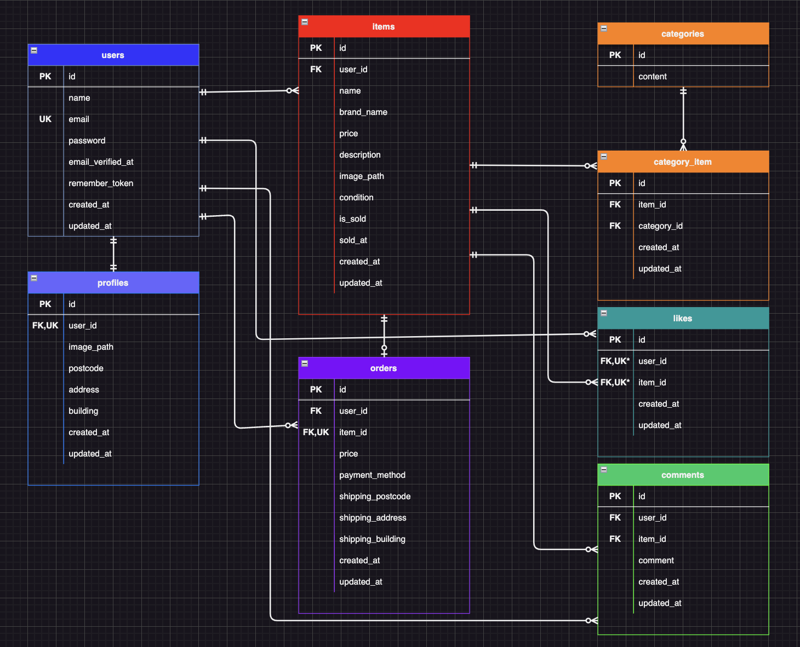

# Furima（フリマアプリ）

個人間で商品を出品・購入できるフリーマーケットアプリケーションです。

## 概要

ユーザー登録後、商品の出品・閲覧・購入、プロフィール編集、いいね・コメント、キーワード検索などが利用できます。
購入フローでは Stripe を利用した決済画面へ遷移します。

## 主な機能

- 会員登録・ログイン・メール認証（Laravel Fortify）
- 商品一覧・詳細・キーワード検索・マイリスト表示
- 商品の出品（画像・カテゴリー・状態など）
- 購入手続き（配送先の一時変更、Stripeによる決済）
- マイページ（出品一覧・購入一覧）
- プロフィール（画像・住所など）の編集
- いいね・コメント

## 環境構築

### 前提

- [Docker Desktop](https://www.docker.com/products/docker-desktop/) が利用できること
- Git

### Docker のビルドと起動

```bash
git clone https://github.com/kn-a0322/furima-app-project.git
cd furima-app-project
docker-compose up -d --build
```

### Laravel 環境（PHP コンテナ内）

```bash
docker-compose exec php bash
cd /var/www
composer install
cp .env.example .env
php artisan key:generate
```

`.env` を編集し、環境変数を変更してください。

```env
DB_CONNECTION=mysql
DB_HOST=mysql
DB_PORT=3306
DB_DATABASE=laravel_db
DB_USERNAME=laravel_user
DB_PASSWORD=laravel_pass
```

続けてマイグレーションとシーディング、公開ストレージのシンボリックリンクを作成します。
（`storage:link` を省略すると商品画像・プロフィール画像がブラウザで表示されません）

```bash
php artisan migrate
php artisan db:seed
php artisan storage:link
```


### 購入機能をテストする場合

Stripe のご自身のテストキーを `.env` に設定してください。

```env
STRIPE_SECRET=sk_test_...
```

### コンテナの停止

プロジェクトルートで実行します。

```bash
docker-compose down
```

## 使用技術（実行環境）

| 区分 | 技術・バージョン（目安） |
|------|-------------------------|
| 言語 | PHP 8.1 |
| フレームワーク | Laravel 10.x |
| 認証 | Laravel Fortify |
| 決済 API | Stripe（`stripe/stripe-php`） |
| データベース | MySQL 8.0.26 |
| Web サーバー | nginx 1.21.1 |
| その他 | Docker / Compose、phpMyAdmin |


## ER 図

データベース設計の概要は以下の画像を参照してください。編集用のソースは `docs/ER.drawio` にあります。



## URL

| 用途 | URL（開発環境） |
|------|-----------------|
| アプリトップ（商品一覧） | http://localhost/ |
| 会員登録 | http://localhost/register |
| ログイン | http://localhost/login |
| phpMyAdmin | http://localhost:8080/ |

phpMyAdmin のログイン例（`docker-compose.yml` に合わせた値）:

- サーバー: `mysql`
- ユーザー名: `laravel_user`
- パスワード: `laravel_pass`

## テスト用ログイン情報

`php artisan db:seed` 実行後、`UsersTableSeeder` で登録されるユーザーです。
本アプリケーションでは管理者権限の機能は実装しておりません。動作確認の際は、以下のユーザーアカウントをご利用ください。

| 表示名 | メールアドレス | パスワード |
|--------|----------------|------------|
| 山田太郎 | `test1@example.com` | `password` |
| 山田花子 | `test2@example.com` | `password` |

シーダー登録済みのユーザーはメール認証済み状態となっています。
新規会員登録からのメール認証フローを確認したい場合は、別途「会員登録」画面から新しいメールアドレスで登録を行なってください。


## テストの実行

PHP コンテナ内で、プロジェクトルート（`/var/www`）から実行します。

```bash
php artisan test
```

